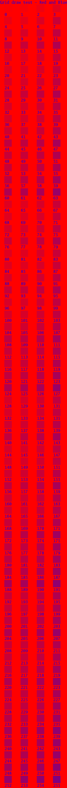

# EightByEight Pattern Generator

This project generates PNG images containing grids of 8x8 pixel patterns. It explores different permutations of patterns based on a modular arithmetic logic for colour dithering.

## Description

The tool creates a grid where each cell contains a unique 8x8 pattern. It renders a title and labels for the grid. The patterns are generated using a "ColourSource" algorithm that determines the color of each pixel based on its coordinates and a mode index.

## Usage

To run the project, you need Go installed.

```bash
go run cmd/eightbyeight/main.go
```

This will generate a file named `out.png` in the current directory.

## Output

The output is a PNG image with a title, a grid of patterns, and labels.

## Examples

Examples of generated patterns can be found in the `exampledata/` directory.

You can also view the latest generated output:



## Builder

The project includes a `GridBuilder` to programmatically configure and generate these pattern grids.

```go
import "github.com/arran4/eightbyeight"

// ...

builder := eightbyeight.NewGridBuilder().
    WithTitle("My Custom Grid").
    WithDimensions(10, 5). // 10 rows, 5 columns
    WithColors([]color.Color{color.White, color.RGBA{255, 0, 0, 255}})

img := builder.Generate()
builder.Save("my_grid.bmp")
```
